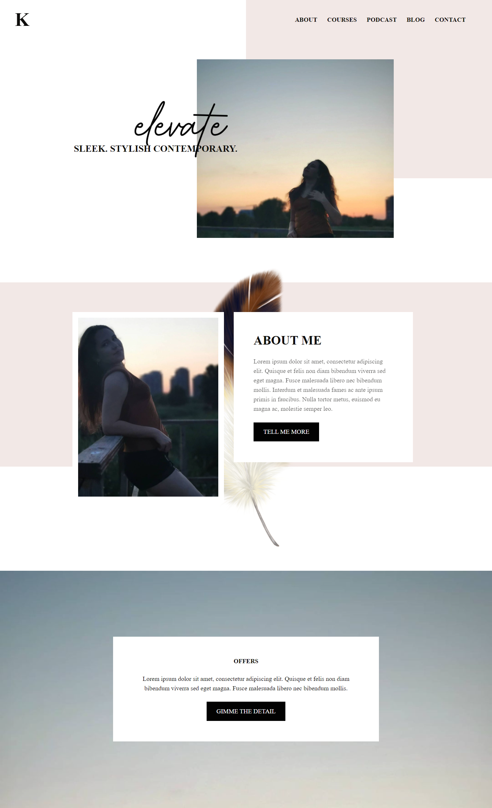
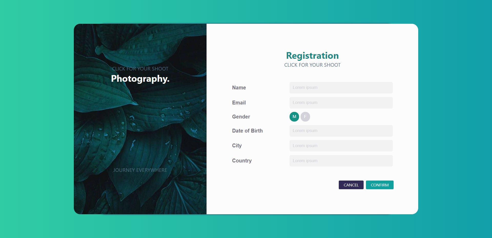

# HTML and CSS Designs

This is a place where will be only  and  templates, for learning purposes.

## Template designs
* Design 1 - [@madalinaeleonorag](https://github.com/madalinaeleonorag)

* Design 2 - [@madalinaeleonorag](https://github.com/madalinaeleonorag)

## Form/Login/Registration designs
* Design 1 - [@madalinaeleonorag](https://github.com/madalinaeleonorag)

* Design 2 - [@madalinaeleonorag](https://github.com/madalinaeleonorag)

* Design 3 - [@madalinaeleonorag](https://github.com/madalinaeleonorag)

* Design 4 - [@madalinaeleonorag](https://github.com/madalinaeleonorag)

